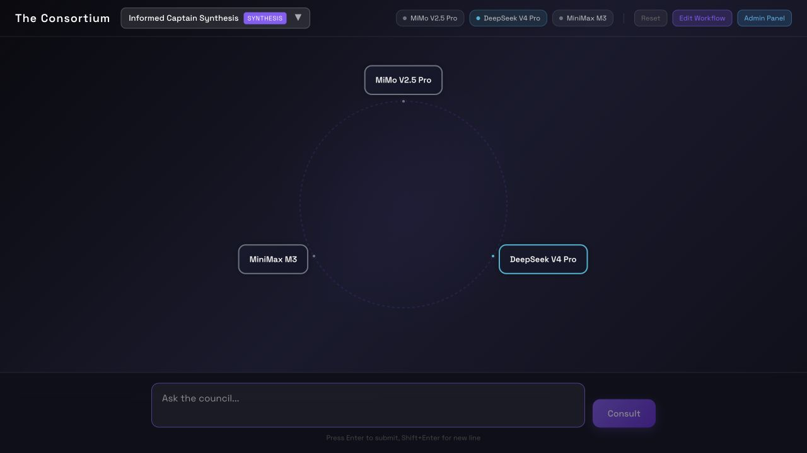
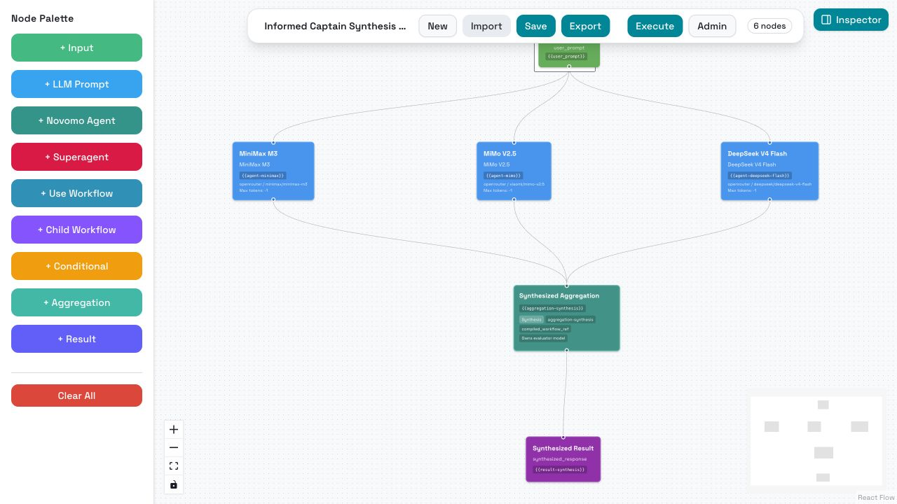
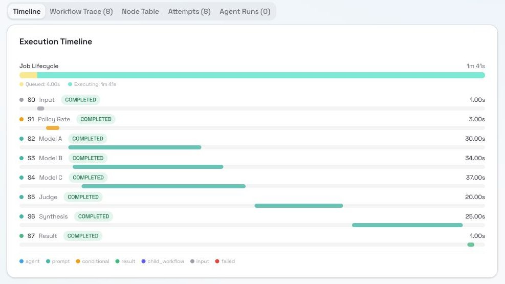
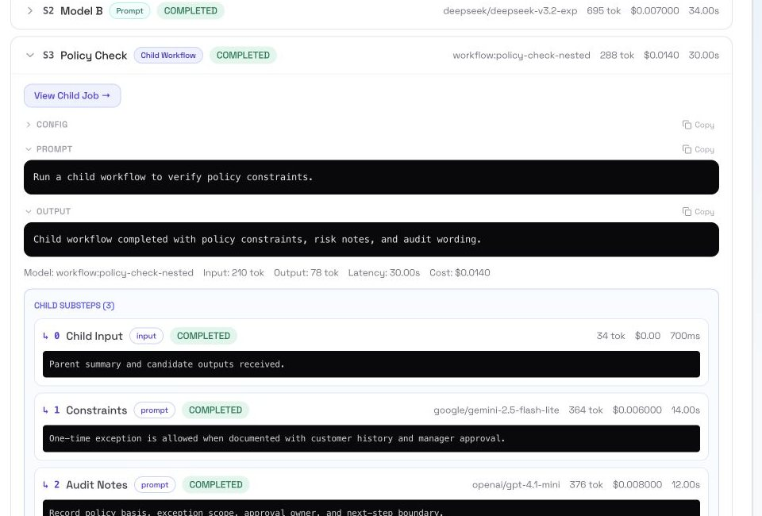
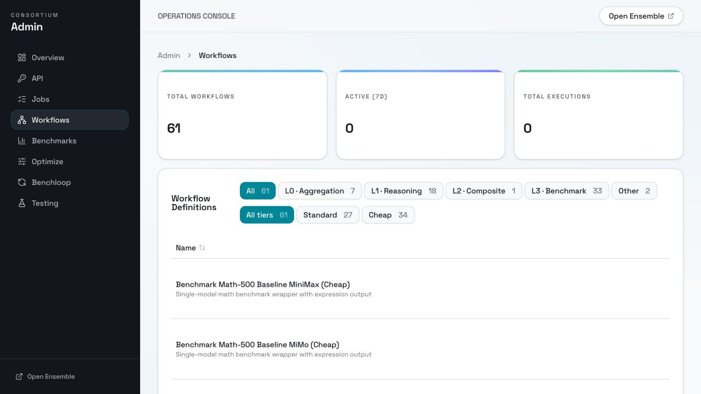
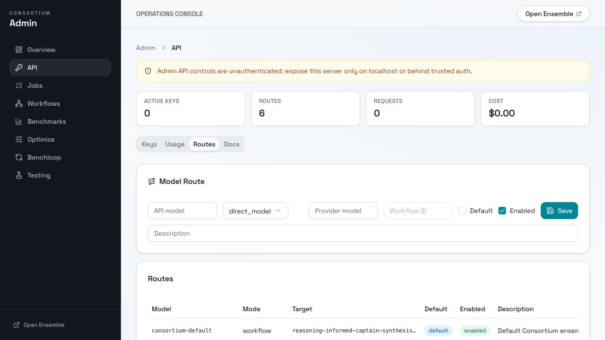
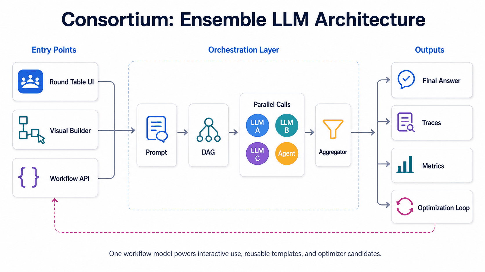
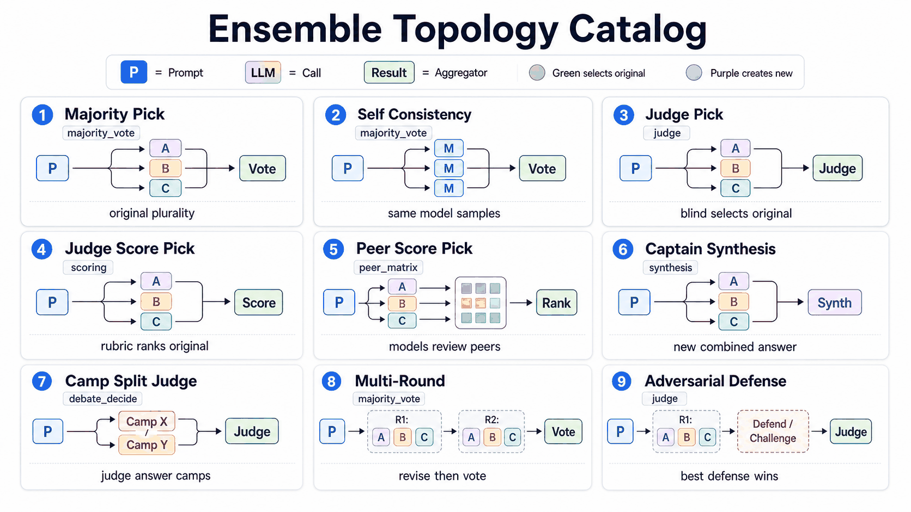
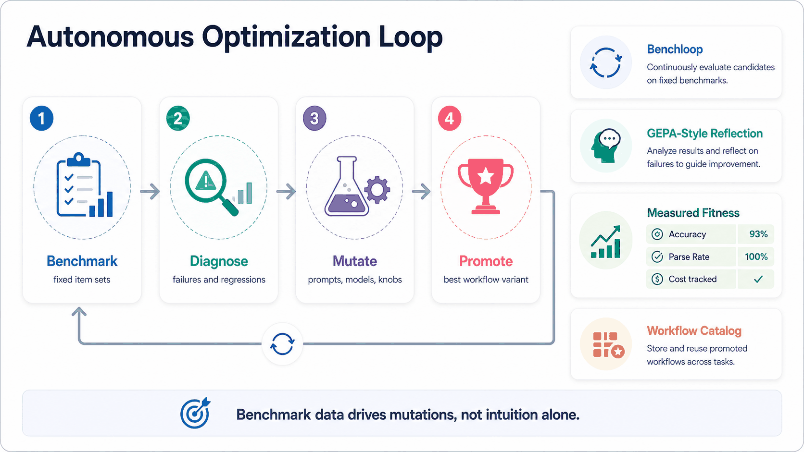

# Consortium

Consortium runs LLM workflows in a reliable, durable, and measured way. It is built for applications that need more than a single model call: durable DAG execution, nested workflows, retries, replay data, audit trails, budgets, cost/token accounting, benchmark tooling, and operator visibility.

Ensemble and fusion methods are first-class in the architecture. Consortium ships with multiple reasoning workflows that call several models, compare or combine their outputs, and expose the result through an OpenAI-compatible `/v1` API. Existing applications can keep their OpenAI SDK/client shape while Consortium handles the workflow complexity behind a model route.

Status: v0.1. The core workflow runtime is usable, but this is still early software. Read the security notes before exposing it outside a trusted environment.

## Visual Tour

| Ensemble UI | Workflow Builder |
| --- | --- |
|  |  |

| Job Timeline | Workflow Trace |
| --- | --- |
|  |  |

| Workflow Catalog | OpenAI-Compatible API Routes |
| --- | --- |
|  |  |

## Architecture

<p align="center">
  
</p>

## Why Ensemble?

- **Reliability for high-consequence decisions.** Legal, healthcare, compliance, finance, and other costly workflows should not depend blindly on one non-deterministic model response. Ensembles can add redundancy, independent checks, visible disagreement, and stronger audit trails. They do not replace domain review, validation, or regulatory controls.
- **Economies of ensemble.** Fusing several cheaper, diverse models can be competitive with a stronger single model on some tasks while lowering model spend. The tradeoff is usually latency and orchestration complexity.
- **Useful theory and empirical precedent.** Condorcet's Jury Theorem motivates independent voters; LLM-as-a-judge, scoring, peer review, and self-consistency methods show practical ways to use multiple model outputs. Consortium makes these patterns runnable and measurable, but you should benchmark them on your own workload.
- **Different tasks fit different reasoning primitives.** Majority vote fits extractable answers such as MCQA, yes/no, classification, and routing. Self-consistency is useful for math, code, and reasoning paths from one strong model. Judge and scoring workflows fit open-ended answers where reasoning quality matters. Synthesis fits reports and summaries that should merge complementary perspectives. Adversarial defense and camp-debate workflows fit ambiguous cases where disagreement itself is useful signal.

<p align="center">
  
</p>

## Why Consortium?

- **Keep your application unchanged.** Point an OpenAI-compatible client at Consortium and route a model name to a direct model or a workflow.
- **Use ensemble topologies out of the box.** Shipped workflows include majority vote, self-consistency, LLM judge, rubric scoring, peer-matrix review, synthesis, adversarial defense, and camp-based debate.
- **Run workflows durably.** Jobs execute as persisted DAGs with nested child workflows, retries, histories, replay data, WebSocket progress, budgets, limits, and cost/token accounting.
- **Measure what works.** Benchmark harnesses, admin analysis views, and workflow attribution make cost, latency, failure modes, and accuracy visible.
- **Optimize semi-autonomously.** Experimental `benchloop` tooling and GEPA-style prompt mutation can iterate on workflow prompts against benchmarks.
- **Operate visually when useful.** The React workflow builder and admin UI let operators inspect, fork, run, and tune workflows without editing JSON by hand.

<p align="center">
  
</p>

## What Ships Today

- Visual workflow builder and preset workflows.
- Durable job execution with nested child workflows, retries, replay data, event history, and WebSocket progress.
- OpenRouter-backed model calls with cost/token accounting.
- OpenAI-compatible Chat Completions and Responses endpoints under `/v1`.
- Local admin/operator UI for jobs, workflows, benchmarks, optimization, and API keys.
- Optional Novomo agent-runtime nodes (`agent_run`, `novo_run` / Superagent).
- Experimental `benchloop` benchmark-tuning workflow.

## Reasoning Primitives

The main user-facing methods are L1 `reasoning-*` workflows. L0 `aggregation-*` workflows are reusable internals, L2 `composite-*` workflows combine primitives, and L3 `benchmark-*` workflows wrap primitives for evaluation. Most primitives also ship with `-cheap` variants.

| Primitive | Best for | Tradeoff |
| --- | --- | --- |
| `reasoning-informed-captain-synthesis` | Unified answers, reports, and summaries that should merge complementary model outputs | Generates new text, so it is not a pure winner selection |
| `reasoning-majority-pick` | MCQA, yes/no, classification, routing, and other extractable answers | Zero-cost aggregation on clear majorities; weak fit for open-ended answers |
| `reasoning-self-consistency-majority-pick` | Checking whether one strong model reaches the same answer through varied samples | Uses sampling diversity, not model-architecture diversity |
| `reasoning-judge-pick` | Fast open-ended winner selection across multiple model answers | Single evaluator is cheap but can be a point of failure |
| `reasoning-judge-score-pick` | Rubric-based evaluation where per-response scores matter | More calls than a judge; dynamic rubrics add one setup call |
| `reasoning-peer-score-pick` | High-scrutiny evaluation with multiple evaluator perspectives | Strongest evaluator diversity, highest cost/latency |
| `reasoning-camp-split-judge-pick` | Discrete answers where disagreement camps and minority reasoning matter | No live back-and-forth; camps are judged in one pass |
| `reasoning-adversarial-defense-judge-pick` | Ambiguous or high-stakes questions where answers should survive challenge | Adds a defense/challenge round before judging |
| `reasoning-multi-round-majority-pick` | Deliberation where agents can revise after seeing peer reasoning | Higher latency than single-round majority vote |

See [docs/reasoning-architecture.md](docs/reasoning-architecture.md) for call counts, layer boundaries, and tuning invariants.

## Requirements

- Go 1.25+
- Bun 1.3.7 for frontend builds (`.bun-version`)
- Make
- POSIX shell tools for local dev scripts (`sh`, `bash`, `lsof`, `curl`, `tail`, `kill`)
- OpenRouter API key for real LLM calls

Windows users should use WSL for the full local development workflow. Release binaries should run natively once published for the target platform.

Fresh machine setup examples:

```bash
# macOS
brew install go bun make

# Debian/Ubuntu/WSL
sudo apt-get update
sudo apt-get install -y git curl unzip make bash lsof ca-certificates
# Install Go 1.25+ from https://go.dev/doc/install
curl -fsSL https://bun.sh/install | bash -s "bun-v1.3.7"
export PATH="$HOME/.bun/bin:$PATH"
```

## Quick Start

```bash
git clone https://github.com/AlhasanIQ/consortium.git
cd consortium

cp .env.example .env
# Edit .env and set OPENROUTER_API_KEY=<your key>

make frontend-install
make dev
```

Open:

- Ensemble UI: http://localhost:3000
- Workflow Builder: http://localhost:3000/builder
- Admin UI: http://localhost:8080/admin

Verify:

```bash
curl http://localhost:8080/health
make test
```

Dev mode uses two ports: Vite serves the live frontend on `FRONTEND_PORT` (default `3000`) and the Go backend serves APIs on `PORT` (default `8080`). Production release builds use a single binary with embedded frontend assets.

## Use An Ensemble From Another App

After `make dev`, create an API key:

```bash
make conctl-build
./bin/conctl api key-create --name demo-app --yes
export CONSORTIUM_OPENAI_API_KEY=<secret returned once>
```

Consortium seeds `consortium-default` as an OpenAI-compatible model route backed by `reasoning-informed-captain-synthesis-cheap`. Optionally create your own route name:

```bash
./bin/conctl api route-upsert \
  --api-model consortium-synthesis \
  --mode workflow \
  --workflow-id reasoning-informed-captain-synthesis-cheap \
  --yes
```

Then point any OpenAI-compatible client at Consortium and use the route as the model:

```js
import OpenAI from "openai";

const client = new OpenAI({
  apiKey: process.env.CONSORTIUM_OPENAI_API_KEY,
  baseURL: "http://localhost:8080/v1",
});

const response = await client.chat.completions.create({
  model: "consortium-default",
  messages: [{ role: "user", content: "Give me a concise risk review." }],
});

console.log(response.choices[0].message.content);
```

The application receives a normal OpenAI-shaped response while Consortium runs the routed ensemble workflow behind the model name.

## Production Build

```bash
make build-release
EMBED_FRONTEND=true OPENROUTER_API_KEY=<OPENROUTER_API_KEY> ./bin/consortium-release
```

For non-loopback binds, set `ADMIN_API_TOKEN` and put the server behind TLS:

```bash
EMBED_FRONTEND=true \
OPENROUTER_API_KEY=<OPENROUTER_API_KEY> \
ADMIN_API_TOKEN=<long random token> \
BIND_ADDR=0.0.0.0:8080 \
./bin/consortium-release
```

Do not publish a raw local working directory. Use Git archives or release artifacts so ignored local files such as `.env`, SQLite databases, benchmark outputs, and generated scratch files cannot leak.

See [docs/deployment.md](docs/deployment.md).

Container build:

```bash
OPENROUTER_API_KEY=<OPENROUTER_API_KEY> \
ADMIN_API_TOKEN=<long random token> \
docker compose up --build
```

## Security Notes

For v0.1, treat Consortium as an operator-facing service unless you have reviewed and configured its auth boundary.

- `/v1/*` requires Consortium API keys.
- `/api/admin/*` can be protected with `ADMIN_API_TOKEN`.
- Builder/job endpoints under `/api/workflows` and `/api/jobs` are intended for the local UI/operator surface in v0.1. Do not expose them directly to untrusted networks.
- Job records may contain prompts, model outputs, workflow config, costs, and provider metadata.
- SQLite database files and logs should be stored in a private directory with restricted permissions.
- If using a reverse proxy, preserve auth headers and configure TLS there.

See [SECURITY.md](SECURITY.md) and [docs/deployment.md](docs/deployment.md#v01-security-limits).

## Optional Novomo Runtime

Novomo-backed nodes are included because Novomo is intended to be a public companion runtime. Consortium only documents the integration surface; detailed Novomo setup belongs in the Novomo project:

- Novomo repo: https://github.com/alhasaniq/novomo
- Novomo site: https://novomo.alhasaniq.com

If `NOVOMO_URL` is not configured/reachable, workflows using `agent_run` or `novo_run` will fail at those nodes. Normal LLM workflows do not require Novomo.

## Experimental Benchloop

`benchloop` is public but experimental. It automates benchmark tuning and can launch Claude CLI sessions with broad local permissions. Review [docs/benchmarks.md](docs/benchmarks.md#experimental-benchloop) before running it.

## Common Commands

```bash
make test             # Go tests
make ci               # Backend + frontend checks
make build            # Go server binary
make build-release    # Single binary with embedded frontend
make conctl-build     # Operator CLI
make benchloop-build  # Experimental benchmark tuning CLI
```

Frontend:

```bash
make frontend-install
make typecheck
make lint-frontend
make ci-frontend
```

Admin CLI examples:

```bash
./bin/conctl local backend-status
./bin/conctl local db-query --sql "SELECT id, status, created_at FROM jobs LIMIT 5"
./bin/conctl api key-create --name local-test --yes
```

## Repository Layout

```text
cmd/server/       Go server entrypoint
cmd/conctl/       Operator CLI
cmd/benchloop/    Experimental benchmark tuning CLI
frontend/         React/Vite frontend
internal/         Internal Go packages
pkg/api/          REST, WebSocket, and OpenAI-compatible API
pkg/admin/        Admin/operator API
pkg/jobs/         Job manager and durable execution coordination
pkg/workflow/     Workflow types, validation, runners, compiler, runtime
pkg/storage/      SQLite schema and stores
pkg/providers/    OpenRouter provider
pkg/bench/        Benchmark loading and evaluation helpers
docs/             Public documentation
scripts/          Local development and release helper scripts
```

## Documentation

| Doc | What it covers |
| --- | --- |
| [Public API](docs/public-api.md) | OpenAI-compatible `/v1` API, model routes, keys, request fields, streaming, background responses, errors, and compatibility limits. |
| [Workflow system](docs/workflow-system.md) | Workflow DAG architecture, node types, runtime behavior, APIs, events, persistence, and execution contracts. |
| [Reasoning architecture](docs/reasoning-architecture.md) | Ensemble layers, L1 reasoning primitives, aggregation methods, call counts, model composition, and tuning invariants. |
| [Deployment](docs/deployment.md) | Release builds, embedded frontend deployment, Docker, reverse proxy notes, and v0.1 production/security limits. |
| [Environment variables](docs/environment-variables.md) | Runtime configuration for ports, storage, workers, providers, admin auth, tracing, Novomo, and deployment. |
| [Benchmarks](docs/benchmarks.md) | Benchmark harness usage, result artifacts, failure taxonomy, retry behavior, and experimental `benchloop`. |
| [Optimization](docs/optimization.md) | Declarative workflow optimization, GEPA-style prompt mutation, optimizer storage, promotion, and leases. |
| [Agent runtime contract](docs/agent-run-contract.md) | Consortium-to-Novomo HTTP contract for `agent_run` / `novo_run` workflow nodes. |
| [Security](SECURITY.md) | Supported versions, vulnerability reporting, and practical v0.1 security guidance. |
| [Contributing](CONTRIBUTING.md) | Development setup, code style, tests, documentation expectations, and contribution workflow. |

## License

Consortium is licensed under GPL-3.0-only. See [LICENSE](LICENSE). Third-party notices are in [NOTICE](NOTICE).
