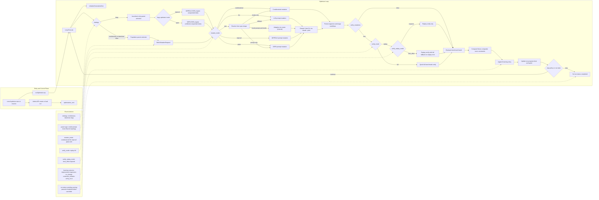

# Declarative Workflow Optimization

## Overview

Consortium supports declarative workflow optimization runs driven by a population loop:

1. Select parent organisms by weighted fitness + novelty.
2. Mutate declaratively declared parameters (`model`, `prompt`, `enum`, `float`, `int`).
3. Evaluate each organism through the existing benchmark runner.
4. Persist lineage, fitness, and learning log in SQLite.
5. Promote the best organism with policy gates.

The optimization loop runs from `conctl optimize start|resume` in the foreground and uses admin APIs for all persistence/evaluation.

## Scope

Optimization scope is limited to workflow semantics declared in `optimize.params`:

- Model IDs, prompts, temperatures, bounded numeric knobs.
- Aggregation config sub-fields (not aggregation method identity by default).
- Extraction patterns and other node-level config declared as tunable.

Out of scope:

- Benchmark runner infra knobs (runner concurrency/fatal guards).
- Admission gates, worker pool counts, env vars, provider credentials.
- DB/system operational settings.

Enforcement is implemented by the leverage validator (`pkg/optimize/lever_validator.go`).

## Seed Annotations

Seed JSON can include a top-level `optimize` section:

- `params`: path/type declarations for mutable fields.
- `locked`: paths that must never change.
- `objectives`: weighted multi-objective score inputs.
- `constraints`: hard feasibility checks.
- `stop_policy`: generation/budget/plateau controls.
- `promotion_policy`: no-regression and minimum gain guardrails.

`optimize` is parsed separately when creating runs; the workflow definition remains standard executable JSON.

## Data Model

Optimizer state is persisted in:

- `optimization_runs`
- `optimization_organisms`
- `optimization_param_changes`

Key behavior:

- Full organism workflow JSON is stored per candidate.
- Fitness captures adjusted accuracy, parse/cost/latency metrics, feasibility, and composite score.
- Learning entries track mutation outcomes and deltas.
- Lease fields (`owner_pid`, `owner_hostname`, `last_heartbeat_at`) coordinate foreground loop ownership.

## Loop Runtime

The loop implementation lives in `pkg/optimize/loop.go` and is interface-based:

- `BenchmarkEvaluator`: benchmark submission/polling/result extraction.
- `PopulationStore`: run/organism/learning persistence.
- `WorkflowManager`: temporary workflow create/delete for candidate evaluation.

Supported optimization paths:

- `strategy: evolutionary` (alias: `darwinian`) — parent sampling via weighted fitness + novelty over a population archive.
- `strategy: dspy` — separate incumbent-only prompt-optimizer loop with dedicated DSPy engines (not the evolutionary mutate-all path). DSPy strategy enforces prompt-only optimize params and resolves optimizer mode to `miprov2` or `gepa` (with `auto` support).

Current runtime adapters are HTTP-based:

- `HTTPBenchmarkEvaluator`
- `HTTPPopulationStore`
- `HTTPWorkflowManager`

## E2E Flow

## Terminology Mapping to DSPy

| Consortium Term | Meaning in Consortium | Closest DSPy Mapping |
|---|---|---|
| `OptimizationRun` | One full optimization campaign with budget, status, and history | Optimizer run invocation |
| `strategy` | Search loop type (`evolutionary` or `dspy`) | Optimizer algorithm choice |
| `Organism` | Full candidate workflow variant with params and fitness | Candidate program or prompt variant |
| `Generation` | One iteration of candidate creation and evaluation | Optimization round or step |
| `MutationRequest` | Parent plus failures plus learning context for proposing children | Proposer context and minibatch context |
| `mutator_mode` | Proposal operator family used to produce candidates | Teleprompter or optimizer style |
| `AdaptiveMixMutator` (internal) | Internal `auto` router for mixed prompt+knob specs | No single exact DSPy primitive; closest to a meta policy over proposal operators |
| `Fitness` | Evaluation metrics plus composite objective and feasibility | Evaluation metrics and objective score |
| `Constraints` and `Feasible` | Hard metric checks used as optimization gates | Constrainted objective or feasibility gating |
| `LearningEntry` | Persisted mutation outcome log used for adaptation and audit | Trial history and optimizer memory |
| `verify_mode` and `verify_replay_mode` | Pre-eval screening policy for candidates | Candidate screening policy |
| `Promote` | Persist best candidate into seed and workflow definitions | Apply chosen optimized program or prompt |

## Mutator Differences

1. `combinatorial`: mutates `model`, `enum`, `float`, `int`; does not invoke Claude Code.
2. `llm`: mutates prompt params via Claude Code (`claude --print`) using failure and learning context.
3. `miprov2`: MIPROv2-style prompt optimizer.
4. `gepa`: GEPA-style reflective prompt optimizer.
5. `auto`: policy router. In `evolutionary`, maps by spec shape (and uses an internal adaptive mix router for mixed prompt+knob specs); in `dspy`, resolves to a DSPy optimizer family (`miprov2` or `gepa`).

### Mutator Comparison Matrix

| Mutator Mode | What It Mutates | Uses Claude Code | Failure-Aware | Best Use Case | Main Tradeoff |
|---|---|---|---|---|---|
| `combinatorial` | `model`, `enum`, `float`, `int` | No | Indirectly (through parent selection and evaluation feedback) | Fast knob and model sweeps, lower-cost search | Cannot rewrite prompts |
| `llm` | `prompt` params | Yes (`claude --print`) | Yes (sampled failure cases and learning log) | Direct prompt rewriting loops | More variance and token cost |
| `miprov2` | MIPROv2-style prompt edits | Yes | Yes (failure minibatch synthesis and mutation history) | Prompt optimization with incumbent search | Does not mutate non-prompt knobs directly |
| `gepa` | GEPA-style reflective prompt edits | Yes | Yes (reflective failure trajectory conditioning) | Reflection-heavy prompt correction | Does not mutate non-prompt knobs directly |
| `auto` | Not a mutator itself, policy router to other modes | Depends on resolved mode | Depends on resolved mode | Safe default across heterogeneous specs | Less explicit operator intent unless status is inspected |

## Mutation Strategy

### Combinatorial Mutator

Handles:

- `model`, `enum`: candidate sampling.
- `float`, `int`: bounded range sampling (step-aware).

### LLM Prompt Mutator

Handles:

- `prompt` params via `claude --print`.

Inputs:

- Current prompt.
- Parent failure cases (analysis + drill-style enrichment).
- Prior failed mutation history.
- Objectives/constraints.
- Strategy-aware failure mini-batches:
  - `evolutionary`/`darwinian`: focused single-type failure bucket per mutation call.
  - `dspy`: uniform random minibatch sample (without replacement) from parent failures.
- Drill-style item enrichment for sampled failures: question text, final raw output, parent/child predictions, agent votes, and category diagnosis hints.

Guardrail:

- L1 reasoning prompt isolation rejects benchmark-specific MCQA contamination.

### MIPROv2-Style Prompt Mutator

Handles prompt params with a MIPROv2-inspired instruction optimization step:

- Synthesizes task/failure patterns from sampled failures.
- Builds multiple prompt candidates per component via Claude Code.
- Performs sequential TPE-style categorical combination search across candidates, with periodic full-eval promotion of top-mean combos.
- Uses recent prompt-mutation outcomes as negative guidance.
- DSPy config parity rules:
  - if `dspy.auto` is set (`light|medium|heavy`), do not set `dspy.num_candidates` / `dspy.num_trials`;
  - if `dspy.auto` is unset and one of `dspy.num_candidates` / `dspy.num_trials` is set, both must be set.

### GEPA-Style Reflective Prompt Mutator

Handles prompt params with GEPA-inspired reflective evolution:

- Reflects over sampled failure trajectories and prior mutation outcomes.
- Uses `reflection_minibatch_size` sampling for reflective context.
- Uses round-robin/all component selection with mutation candidates generated via Claude Code.
- Requires exactly one GEPA budget control in `dspy`: `auto` or `max_full_evals` or `max_metric_calls`.
- In `candidate_selection_strategy=pareto`, Pareto prioritization is applied after measured benchmark evaluation (not Claude self-scores).
- Enforces metric-call budgeting in DSPy loop when GEPA budget is configured (`auto`, `max_full_evals`, or `max_metric_calls`).

### Adaptive Mix Mutator (Auto Internal)

For mixed prompt+knob specs under `mutator_mode=auto` in evolutionary runs, the optimizer uses an internal adaptive mix router that dispatches between combinatorial and prompt mutators and adapts operator mix over time using recent learning-log outcomes.

Supported mutator modes:

- `combinatorial`
- `llm`
- `miprov2`
- `gepa`
- `auto` (spec-driven policy: prompt-only -> GEPA, mixed prompt+knobs -> MIPROv2-style branch, knob-only -> combinatorial)

## Selection

Parent selection uses sigmoid-scaled fitness with novelty bonus:

- Midpoint is percentile-based (default p75).
- Novelty down-weights overused parents by child count.
- Sampling is with replacement to balance exploitation and exploration.
- Parent eligibility requires evaluated organisms; feasibility is preferred when feasible candidates exist.
- For prompt-tunable runs, parents with unresolved failures are preferred (fallback to all eligible parents if none remain).

## Promotion

`POST /api/admin/optimize/runs/{id}/promote`:

1. Selects the best feasible organism (not just the stored best ID) and ensures baseline fitness exists.
2. Checks min adjusted-accuracy gain.
3. Enforces no-regression metrics from policy.
4. Enforces optimistic locking via `workflows.version`.
5. Atomically rewrites seed file via temp file + rename.
6. Updates DB workflow definition.

In v1, `require_generalization_check` is acknowledged but non-MCQA gate execution is deferred.

## Ownership and Heartbeats

Foreground loop ownership model:

- Heartbeat every 10 seconds.
- Active lease TTL is 30 seconds.
- Lease takeover is rejected while an active owner heartbeat exists.
- Ctrl-C pauses run and clears lease.

## Admin API Surface

Optimization endpoints under `/api/admin/optimize`:

- `GET /runs`
- `POST /runs`
- `GET /runs/{id}`
- `POST /runs/{id}/pause`
- `POST /runs/{id}/resume`
- `POST /runs/{id}/cancel`
- `PATCH /runs/{id}/heartbeat`
- `PATCH /runs/{id}/progress`
- `PATCH /runs/{id}/status`
- `GET /runs/{id}/organisms`
- `POST /runs/{id}/organisms`
- `GET /runs/{id}/organisms/{orgID}`
- `GET /runs/{id}/lineage`
- `GET /runs/{id}/learning-log`
- `POST /runs/{id}/learning-log`
- `POST /runs/{id}/promote`
- `GET /compare`
- `GET /organisms/{orgID}`
- `PATCH /organisms/{orgID}/fitness`
- `GET /organisms/{orgID}/lineage`
- `GET /organisms/{orgID}/param-changes`
- `POST /organisms/{orgID}/param-changes`
- `GET /organisms/{orgID}/mutation-artifacts`
- `POST /organisms/{orgID}/mutation-artifacts`

Admin UI routes:

- `/admin/optimize`
- `/admin/optimize/:id`
- `/admin/optimize/:id/organisms/:orgId`
- `/admin/optimize/compare`

Current admin optimize pages are observation/debugging focused. Promotion is performed via CLI/API.

## CLI Surface

Primary commands:

- `conctl optimize start`
- `conctl optimize resume`
- `conctl optimize status`
- `conctl optimize spec`
- `conctl optimize compare`
- `conctl optimize artifacts`
- `conctl optimize export`
- `conctl optimize list`
- `conctl optimize organisms`
- `conctl optimize best`
- `conctl optimize diff`
- `conctl optimize lineage`
- `conctl optimize learning-log`
- `conctl optimize promote`
- `conctl optimize pause|cancel`

Command highlights:

- `conctl optimize start --strategy <evolutionary|darwinian|dspy>`: choose evolutionary population search vs DSPy-style incumbent loop.
- `conctl optimize start --mutator-mode <combinatorial|llm|miprov2|gepa|auto>`: choose operator family. `evolutionary` supports all modes; `dspy` resolves to `miprov2` or `gepa` (`auto` supported, prompt-only spec required).
- `conctl optimize status`: generation timeline + stop reason
- `conctl optimize learning-log --outcome <type>`: filter learning entries by outcome
- `conctl optimize lineage --organism <id>`: trace ancestry of a specific organism
- `conctl optimize organisms --show-changes`: show param changes per organism

## Current Limits (v1)

- Parameter-only mutation; topology mutations are deferred.
- Weighted composite objective scoring (no Pareto frontier yet).
- Generalization gate (`RequireGeneralizationCheck`) exists in schema but is not enforced at promotion time.
